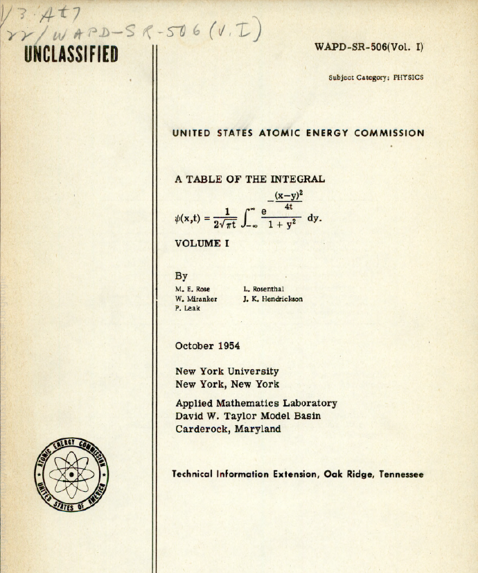

# Breit-Wigner
Esta equação é usada para modelar como nêutrons interagem com núcleos no combustível nuclear.

# 📊 Tabela Convoluída da Integral  psi(x, t)

Este projeto fornece uma implementação em Python da integral convoluída associada à fórmula de Breit–Wigner de ressonância nuclear, convoluída com uma distribuição de velocidades de espalhadores térmicos de Maxwell. 

A função ( psi(x, t) representa a base para o cálculo da **seção de choque efetiva**, essencial na modelagem de reatores nucleares térmicos.

Ela representa a convolução da seção de choque de ressonância com a distribuição de velocidades dos nêutrons térmicos. 

Os parâmetros envolvidos são:

- **x**: diferença adimensional entre a energia do nêutron e a energia de ressonância;
- **t**: parâmetro relacionado à temperatura do espalhador, razão de massas e largura de ressonância.

## 📚 Base de Dados

O projeto inclui dados digitalizados do relatório técnico [WAPD-SR-506](https://www.osti.gov/biblio/4364484), volume I, que contém valores tabelados de psi(x,t) para múltiplas combinações de x e t:

Ao final gera uma planilha com todos os valores entre T= 0 e t = 2

You can reach me at rmilhomem[at]gmail[dot]com or connect on [LinkedIn](https://www.linkedin.com/in/rodolfo-space-force/) for collaborations.

## Licença

Este projeto está licenciado sob a Licença MIT. Você pode usar, modificar e redistribuir este código livremente, desde que mencione o autor original.

